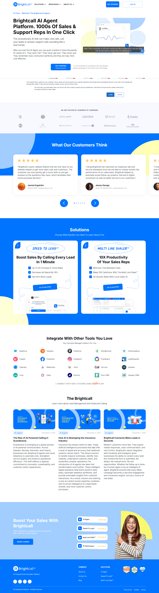

# Отчёт по странице https://brightcall.ai/

## Описание от модели

1. Сайт Brightcall — платформа с ИИ‑агентом, который звонит клиентам для продаж и поддержки. Он для компаний, которым нужно быстро обзванивать лидов и отвечать на звонки.

2. Что можно сделать на странице:
- Нажать «Get Started» и создать аккаунт или запросить бесплатный доступ.
- Войти в систему («Log in»).
- Посмотреть решения (например, Speed to Lead и Multi Line Dialer) и записаться на демо.

3. Крупные блоки сверху вниз:
- Шапка: логотип, меню (Solutions, Resources, About Us), кнопки Get Started и Log In.
- Герой‑блок с большим заголовком про AI Agent, описанием и кнопкой «Get Started».
- Полоса логотипов компаний, которые пользуются сервисом.
- Отзывы клиентов со звёздами и переключателями слайдов.
- Раздел Solutions с карточками решений и их выгодами.
- Интеграции с другими сервисами (сеткой логотипов).
- Блог/новости «The Brightcall» с карточками статей.
- Большой призыв «Boost Your Sales» и кнопка «Book a demo».
- Подвал: ссылки компании и продукта, иконки/значки.

4. Простое объяснение:
- Этот сайт предлагает умного помощника, который сам звонит людям.
- Он говорит как человек и помогает отделу продаж и поддержки.
- На странице видно большую кнопку, чтобы начать пользоваться сервисом.
- Есть отзывы от пользователей со звёздочками, чтобы показать доверие.
- Даны два главных решения и краткие выгоды от них.
- Показаны программы, с которыми сервис дружит, чтобы их можно было подключить.
- Ниже есть статьи, где можно почитать про звонки и ИИ.
- В конце предлагают записаться на показ сервиса.
- В подвале есть нужные ссылки и информация о компании.

## Краткий комментарий автора

Комментарий ещё не добавлен. Заполните этот блок вручную после просмотра отчёта.
