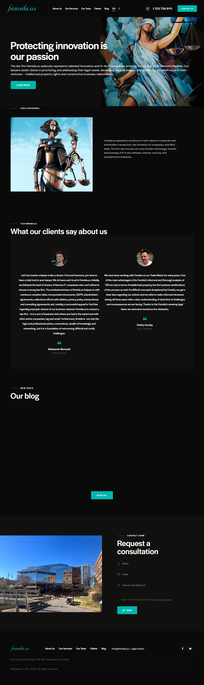

# Отчёт по странице https://femida.us

## Описание от модели

1) Это сайт юридической фирмы для изобретателей и ИТ‑компаний. Они помогают защитить идеи и выйти на рынки США и Европы.

2) Что можно сделать:
- Узнать об услугах и опыте фирмы.
- Прочитать отзывы и блог.
- Оставить заявку на консультацию или позвонить.

3) Крупные блоки сверху вниз:
- Шапка: логотип, меню (About Us, Services, Team, Clients, Blog), выбор языка, телефон, кнопка Contact Us.
- Большой первый экран: слоган про защиту инноваций, краткий текст, кнопка Learn More, картинка.
- Our Experience: описание опыта фирмы и иллюстрация.
- Testimonials: отзывы клиентов с фото.
- Our blog: заголовок и кнопка Read All.
- Request a consultation: форма (имя, e‑mail, сообщение, согласие на обработку), кнопка Send; рядом фото здания.
- Подвал: логотип, повтор меню, адрес, e‑mail, юридическая информация и иконки соцсетей.

4) Пояснение:
- Это главная страница фирмы, которая защищает умные идеи и помогает бизнесу.  
- Сразу видно большой заголовок и кнопку, чтобы узнать больше.  
- Дальше рассказывают, в чём они сильны и с кем работали.  
- Есть отзывы реальных клиентов с короткими историями.  
- Ниже раздел с блогом, где можно почитать новые материалы.  
- В конце есть простая форма: пишете имя, почту и вопрос.  
- Можно согласиться на обработку данных и отправить заявку.  
- В подвале указаны адрес, почта и ссылки.  
- Меню вверху помогает быстро перейти к услугам, команде и клиентам.

## Краткий комментарий автора

Комментарий ещё не добавлен. Заполните этот блок вручную после просмотра отчёта.
