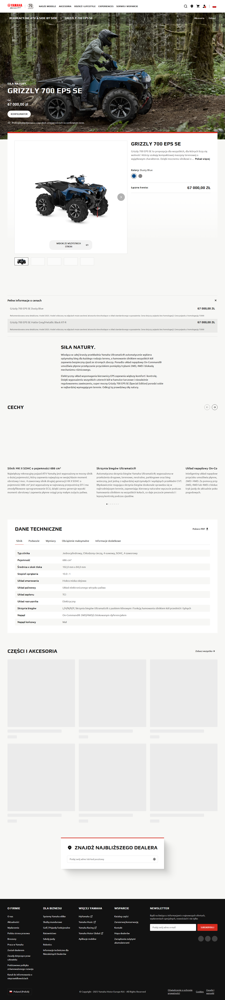

# Отчёт по странице https://www.yamaha-motor.eu/pl/pl/atv-side-by-side/leisure/pdp/grizzly-700-eps-se/

## Описание от модели

1) Это страница товара на сайте Yamaha. Здесь показан квадроцикл GRIZZLY 700 EPS SE для людей, которым нужен мощный ATV для бездорожья.

2) Что можно сделать:
- Посмотреть фото, описание и цену квадроцикла.
- Выбрать цвет и изучить характеристики и особенности.
- Найти ближайшего дилера и связаться для покупки.

3) Крупные блоки сверху вниз:
- Шапка: логотип Yamaha, меню разделов, поиск и значки аккаунта/корзины.
- Большой баннер с фото квадроцикла, названием и ценой, кнопка «Выбрать дилера».
- Блок товара: галерея фото, выбор цвета, краткое описание и цена.
- «Полные сведения о цене» — раскрывающийся список с деталями стоимости.
- Текстовый блок с описанием модели.
- «Cechy» — основные особенности.
- «Dane techniczne» — таблица технических данных.
- «Części i akcesoria» — предлагаемые аксессуары.
- Поиск дилера по адресу.
- Подвал: ссылки, помощь, и форма подписки на новости.

4) Это страница про один конкретный квадроцикл. Сразу видно имя модели и цену — 67 000 zł. Можно листать большие фотографии, чтобы рассмотреть технику. Есть выбор цвета. Ниже простыми словами описано, чем хороша эта модель. Ещё ниже показаны главные функции и таблица с техническими данными. Можно посмотреть доступные аксессуары. В конце есть поле, чтобы найти ближайшего дилера и связаться. Внизу — ссылки и подписка на новости.

## Краткий комментарий автора

Комментарий ещё не добавлен. Заполните этот блок вручную после просмотра отчёта.
